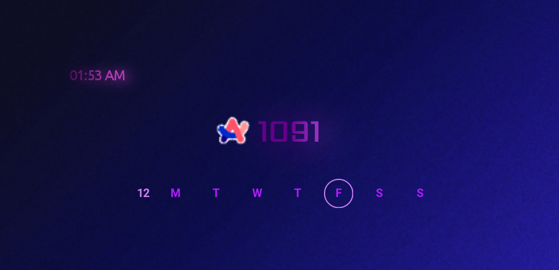

## How to setup Arc Counter Widget using KWGT in an Android Device

A simple Android Home screen Widget for getting realtime update of Arc Window Beta Counter with clock and weekday.

### Step 1

Download [KWGT App from playstore](https://play.google.com/store/apps/details?id=org.kustom.widget&hl=en&gl=US)

### Step 2

Complete the onboarding process
(if you are privacy concern, i recommend dont allow any permission other than storage access, You can skip most permission like contacts and battery optimization...)

Remember to select a appropriate folder as (Use this Folder)
eg: Downloads/KWGT/

### Step 3

Download my Widget Preset from this repository: [Arc_Windows_Beta_Testers_Counter.kwgt](./widgets/Arc_Windows_Beta_Testers_Counter.kwgt)

### Step 4

Move this downloaded file to your KWGT folder under autosave folder
eg: Downloads/KWGT/Kustom/autosave

### Step 5

Add a 4x1 KWGT widget in home screen adn resize it.

### Step 6

Click on the newly created Home screen Widget and it will open KWGT editor, Now go to backups tab and there you can see "Arc Windows Beta Tester Counter" widget, select it.

This will open main editor. Click on save. Now click on back multiple time so you reach the Home screen, there you can see Our Widget

> [!NOTE]
> Our widget only updates the data every hour. If you want to get new data manually just click on the widget, it will refresh the counter.

## FAQ

The Widget doesnt change even after I save. Why?

This might be a common error on KWGT. You can solve that by again clicking on the Wiget and do the <a href="#step-6">Step 6</a> again 

